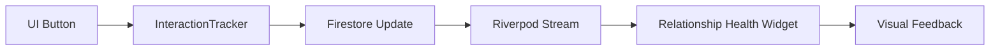

# Vivapro - Architecture & Core Flow Documentation

## Overview
Vivapro is a relationship maintenance application designed to help users stay in touch with their most important contacts. It uses a combination of scheduled reminders, relationship health tracking, and AI-driven insights to ensure users maintain a consistent interaction frequency with their "Favorites."

---

## Technical Stack
- **Framework**: Flutter
- **State Management**: 
  - **Riverpod**: Used for global services, repositories, and data streams.
  - **Bloc/Cubit**: Used for localized UI state and complex business logic (Auth, Call Logs, Scheduling).
- **Backend**: Firebase (Authentication & Cloud Firestore).
- **Core Dependencies**:
  - `flutter_contacts`: Native contact integration.
  - `flutter_local_notifications`: Scheduled reminders.
  - `url_launcher`: Dialing calls and sending messages.

---

## Core Flow

### 1. Bootstrapping & Authentication (`lib/core/`)
- **Bootstrap**: On app launch, `bootstrap.dart` initializes Firebase, sets up the `NotificationService`, and prepares the `BackgroundTaskManager`.
- **Auth Checker**: The `AuthChecker` widget sits at the root. It listens to the `firebaseAuthRepository` (via Riverpod) and routes users to either the `SignInPage` or the `NavigationPage` based on their login state.

### 2. Managing Favorites (`lib/features/contacts/`)
- **Selection**: Users can search their device contacts and "Favorite" them.
- **Onboarding**: When adding a favorite, users select a **Call Frequency** (Daily, Weekly, Monthly, etc.) and a **Priority**.
- **Persistence**: Favorite settings are stored in Firestore under `users/{uid}/favorites/{contactId}`.

### 3. Home & Insights (`lib/pages/home/`)
- **Relationship Health**: The `InsightsSection` uses the `InsightGenerator` to analyze interaction history against target frequencies.
- **Insights**: If a contact is "Overdue," the app generates a "Reconnect" insight card.
- **Actions**: Insight cards allow immediate "Call Now" or "Remind Later" (which schedules a call for tomorrow).

### 4. Interaction Tracking (`lib/core/services/interaction_tracker.dart`)
- This is the "Pulse" of the app. Every time a user taps a "Call" button (in the `ContactDetailsPage`, `FavoriteTile`, or a Notification), the `InteractionTracker` records the event.
- It updates the `lastInteractionAt` field in the Firestore Favorite document.
- **Reactive UI**: Because repositories use `StreamProvider`, the UI (Relationship Health widgets) updates instantly as soon as a call is recorded.

### 5. Scheduling & Notifications (`lib/features/schedule_call/`)
- **Planning**: Users can schedule specific calls for a future date/time.
- **Reminders**: When a call is scheduled, the `NotificationService` creates a local system notification.
- **Handling**: The `NotificationHandler` (integrated into the main `Vivapro` widget) listens for notification taps. It can trigger "Call Now" or "Remind Later" logic directly from the system tray.

---

## Widget & Page Interaction

### Navigation Logic
The `NavigationPage` manages the bottom bar and switches between:
- **Home**: Overview of health and insights.
- **Recents/Activity**: Recent app activities and notifications.
- **Quick Action**: Central button to add/view schedules.
- **All Contacts**: Searchable list of system contacts.
- **Profile**: App settings and account management.

### The "Favorite" Lifecycle
1. **ContactPickerPage** -> User selects a contact.
2. **AddFavoritePage** -> User sets frequency/priority.
3. **Firestore** -> Data is saved.
4. **FavoritesStream** -> Riverpod emits new data.
5. **Home/ContactDetails** -> UI rebuilds with the new Favorite information.

### Interaction Logic Flow

---

## Key Services

| Service | Responsibility |
|---------|----------------|
| `NotificationService` | Manages local notifications and background interpretation. |
| `InteractionTracker` | Writes interaction timestamps to Firestore and launches the dialer. |
| `InsightGenerator` | Analyzes history vs frequency to produce actionable prompts. |
| `RelationshipStateEngine` | Pure logic for calculating health percentages and status strings. |
| `BackgroundTaskManager` | (Planned) Handles periodic cleanup or sync tasks. |

---

## Data Model: FavoriteContact
Stored in `lib/features/contacts/data/favorite_contact.dart`:
- `id`: Unique identifier (usually the device contact ID).
- `contactDetails`: Serialized name, phone, and photo.
- `priority`: How "important" the contact is.
- `callFrequency`: The target interaction interval (Enum).
- `lastInteractionAt`: Timestamp of the last recorded call.
- `createdAt`: When the contact was favorited.
